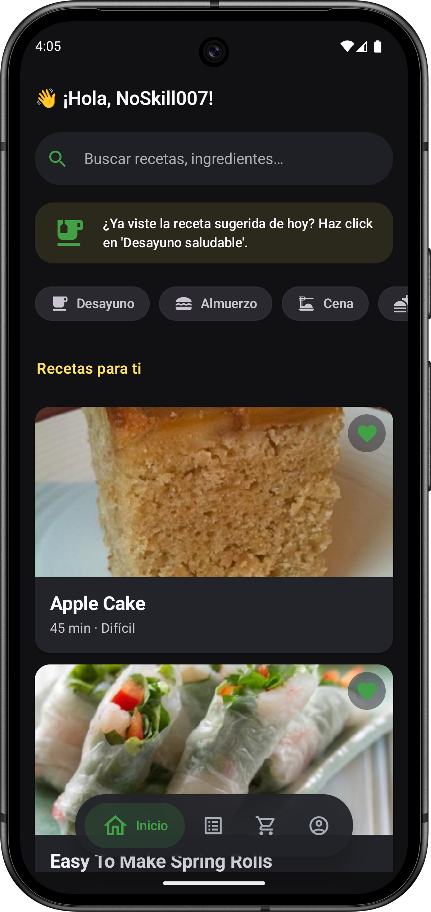
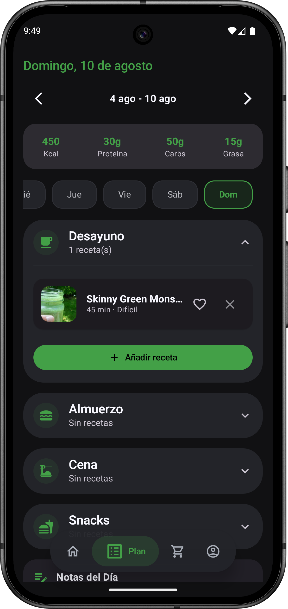
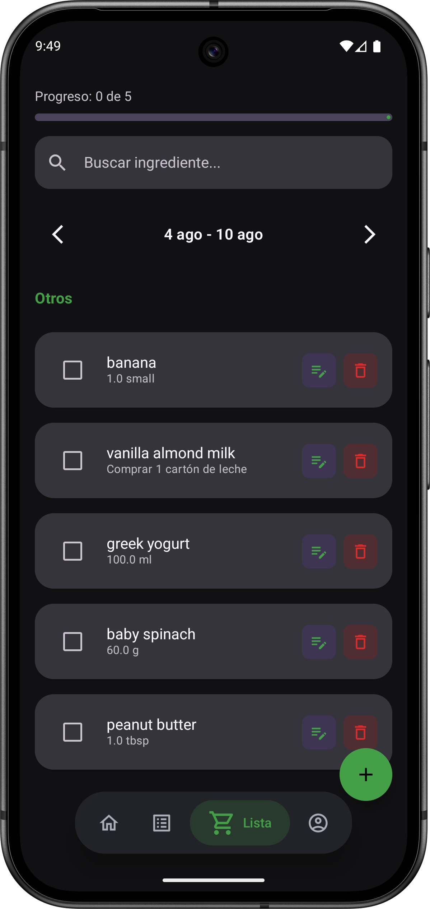
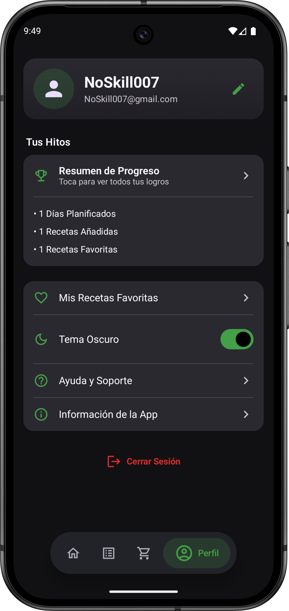

# AnyMeal

AnyMeal is a comprehensive meal planning and recipe management mobile application developed for Android. This university project provides users with an intuitive platform to discover recipes, plan meals, manage shopping lists, and track their culinary achievements.

## Main Features

- **Recipe Discovery**: Browse and search through a comprehensive recipe database
- **Meal Planning**: Create and manage personalized meal plans
- **Shopping Lists**: Generate and organize shopping lists based on selected recipes
- **Favorites Management**: Save and organize favorite recipes for quick access
- **User Profiles**: Personalized user accounts with profile customization
- **Achievement System**: Track cooking milestones and earn achievements
- **Recipe Details**: View detailed cooking instructions, ingredients, and nutritional information
- **Dark/Light Theme**: Toggle between dark and light theme modes
- **User Authentication**: Secure login and registration system

## Technologies Used

- **Kotlin** - Primary programming language
- **Jetpack Compose** - Modern Android UI toolkit
- **Dagger Hilt** - Dependency injection framework
- **Retrofit** - HTTP client for API communication
- **Navigation Compose** - Navigation component for Jetpack Compose
- **Material Design 3** - Modern UI design system
- **Coil** - Image loading library for Compose
- **OkHttp** - HTTP client with logging interceptor
- **Gson** - JSON serialization/deserialization

## Architecture & Folder Structure

The project follows a clean architecture pattern with clear separation of concerns:

```
app/src/main/java/com/noskill/anymeal/
├── data/              # Data layer (repositories, data sources)
├── dto/               # Data transfer objects
├── navigation/        # Navigation graph and routes
├── ui/
│   ├── components/    # Reusable UI components
│   ├── models/        # UI state models
│   ├── screens/       # Compose screens
│   └── theme/         # App theming and styling
├── util/              # Utility classes and extensions
├── viewmodel/         # ViewModels for state management
└── MainActivity.kt    # Main application entry point
```

**Key Architectural Components:**
- **MVVM Pattern**: Model-View-ViewModel architecture for clean separation
- **Dependency Injection**: Hilt for managing dependencies
- **Navigation**: Single-activity architecture with Compose Navigation
- **State Management**: ViewModels with LiveData/StateFlow for reactive UI

## Screenshots

### Home Screen

*Browse featured recipes and navigate to different sections*

### Recipe Detail

*Detailed view with ingredients, instructions, and cooking information*

### Meal Planning

*Plan your meals for the week with calendar view*

### Shopping List

*Organized shopping lists based on selected recipes*

### Profile & Achievements

*User profile with achievements and personal settings*

---

*Developed as part of a university mobile development project*
